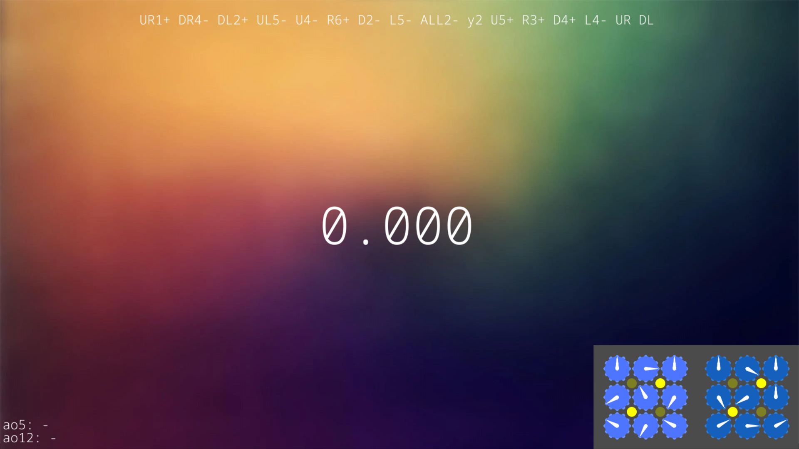
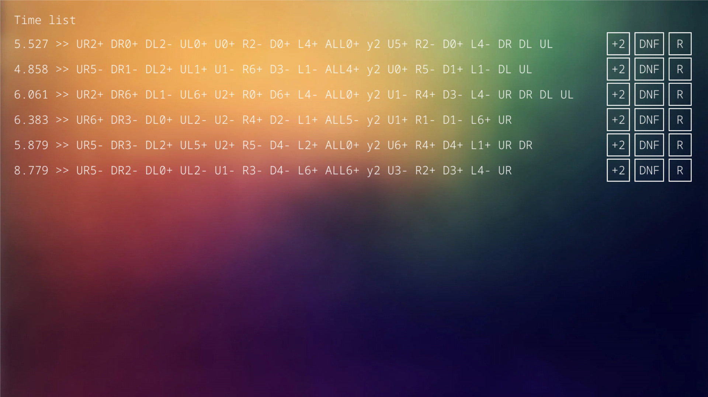
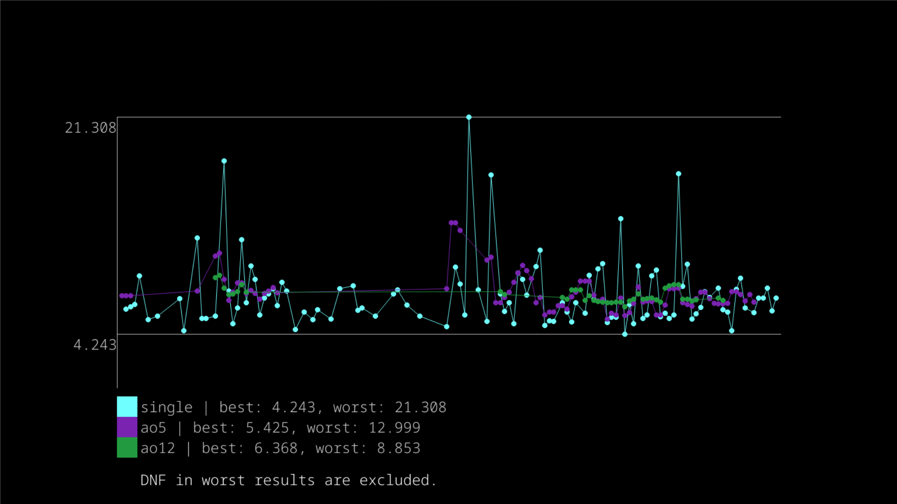

# Cubescramble-rewrite documentation

Welcome to the cubescramble-rewrite documentation! I will explain some stuff about this timer.\
If something is not clear, feel free to ask me on discord or open an issue on github!

## Main screen

### Hotkeys:

- Press `esc` to exit.
- Press `r` to rescramble.
- Press `s` to switch between timing modes (spacebar and stackmat).
- Press `ctri` and `c` to copy the current scramble on the screen to your clipboard.
- Press `ctri` and `s` to configure settings.
- Press `ctri` and `t` to view time list.
- Press `ctri` and `h` to view time history as graph.
- Hold `space` and release it to start the timer. (if stackmat mode is enabled, you have to start the stackmat)

## Setting screen

### Settings
 
Setting options are the following:
- device_num (int): Device number of the sound device to which your stackmat (USB mic) is connected. It should look something like "Microphone 1 (USB Audio Device)"
- background_url (str): Directory or url of your background image. if background_local is enabled, this should be a link to your local image file, otherwise to an image on the internet. Example: "https://example.com/image.png" or "my_background.png"
- background_local (bool): If enabled, this means your background image is stored somewhere in this local directory, otherwise on the internet.
- background_scale (str): If "true", the program tries to fill the screen with your background, if "aspect", the program tries to fill the screen with background while the aspect ratio of the image remains the same.
- current_event (str -> toggleable): Current event of the scrambler.
- draw_scramble (bool): If enabled, it draws the scramble at the bottom right of the main screen.
- particles (bool): If enabled, it will spawn particles after you've completed a solve.
- hide_mouse (bool): If enabled, the mouse will remain invisible in the main window.
- history_draw_length (int): Length of how long the time history will render.

### Hotkeys:

- Press `ctri` and `s` to exit the setting screen.

Configuring options for each type of setting:

- int: if selected, left arrow and right arrow keys can be used de decrement/increment the value. Pressing `backspace` will set the value to 0.
- bool: if clicked, the value will switch between true/false.
- str: if selected, typing letters will add the typed letter to the value. Pressing `backspace` will remove one character from the value. Pressing `ctri` and `backspace` will clear the entire value.

## Time list

### Controls

- Clicking on "+2" button will add +2 penalty on the solve.
- Clicking on "DNF" button will add a DNF penalty on the solve.
- Clicking on "R" button will reset all the penalties on the solve.

### Hotkeys

- Press `ctri` and `t` to exit the time list.

## Time history graph

### Hotkeys

- Press `ctri` and `h` to exit the time list.