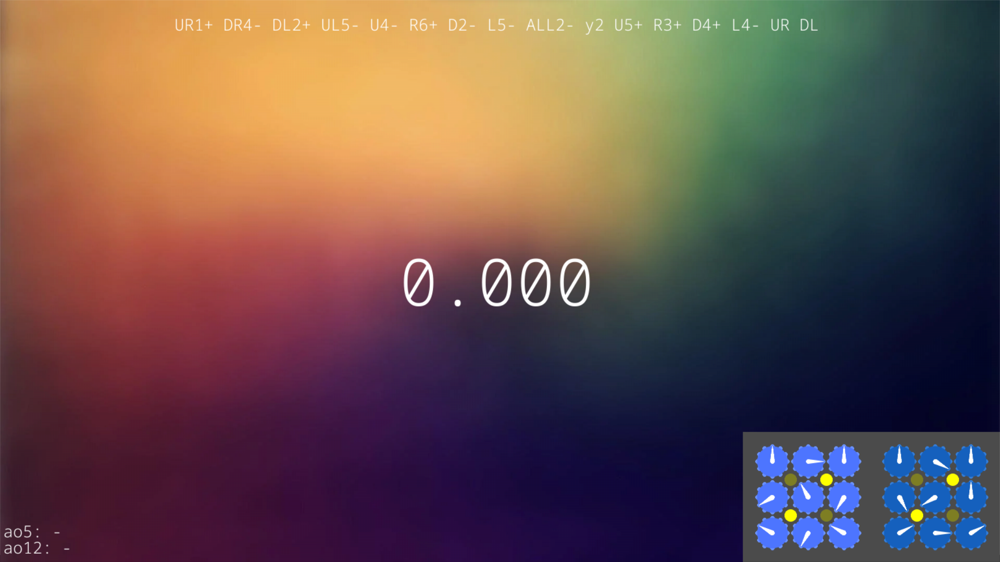
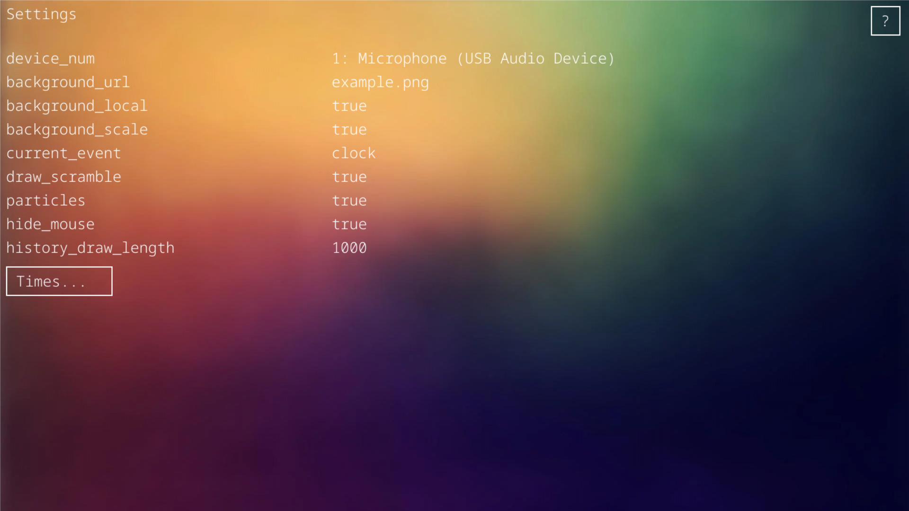

# Help docs

Welcome to the help docs! I will explain some stuff about this timer.\
If something is not clear, feel free to ask me on discord or open an issue on github!

## Main screen

### Hotkeys:

- Press `esc` to exit.
- Press `r` to rescramble.
- Press `s` to switch between timing modes (spacebar and stackmat).
- Press `ctri` and `s` to configure options.
- Hold `space` to start the timer.

## Setting screen

### Settings

- device_num: Device number of the sound device to which your stackmat (USB mic) is connected. Select and adjust it with the arrow keys. It should look something like "Microphone 1 (USB Audio Device)"
- background_url: Directory or url of your background image. if background_local is enabled, this should be a link to your local image file, otherwise to an image on the internet. Example: "https://example.com/image.png" or "my_background.png"
- background_local: If enabled, this means your background image is stored somewhere in this local directory, otherwise on the internet.
- background_scale: If "true", the program tries to fill the screen with your background, if "aspect", the program tries to fill the screen with background while the aspect ratio of the image remains the same.
- draw_scramble: If enabled, it draws the scramble at the bottom right of the main screen.
- times: Times saved. Select and press backspace to delete it.
- particles: If enabled, it will spawn particles after you complete a solve.
- hide_mouse: If enabled, the mouse will remain invisible in the main window.

### Hotkeys:

- Press `ctri` and `s` to exit the setting screen.